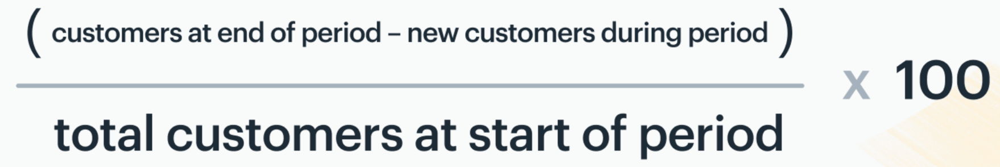

# 1.The objective of this project

This kaggle challenge is to predict whether a customer will change telecommunications provider. 

The evaluation metric for this competition is the test accuracy, defined as follows:

\[\text{Accuracy} = \frac{\text{Number of correctly predicted test samples}}{\text{Total number of test samples}}\]

Customer churn is one of the most important fields in the business analysis and the critical goals of businesses. It is easier and less expensive to focus on retaining existing customers than acquire new ones. Increasing customer retaintion rates by a few % could increase profits significantly. Predicting customer churn will help a business to retain their exisiting customers, and also expand identfying potential customers. 
The heart of churn management lies in being able to identify the early warning signals from potential attritors. Machine learning will provide a solution so that businesses will make proactive movements to stop customers from swtiching to competitors, or stoping subscribing services.

# 2.Data details

#### train data
* 4250 observations, 19 features
* 3652 samples (85.93%) belong to class churn=no and 598 samples (14.07%) belong to class churn=yes
#### test data
* 750 observations

#### Features
* state, string. 2-letter code of the US state of customer residence
* account_length, numerical. Number of months the customer has been with the current telco provider
* area_code, string="area_code_AAA" where AAA = 3 digit area code.
* international_plan, (yes/no). The customer has international plan.
* voice_mail_plan, (yes/no). The customer has voice mail plan.
* number_vmail_messages, numerical. Number of voice-mail messages.
* total_day_minutes, numerical. Total minutes of day calls.
* total_day_calls, numerical. Total number of day calls.
* total_day_charge, numerical. Total charge of day calls.
* total_eve_minutes, numerical. Total minutes of evening calls.
* total_eve_calls, numerical. Total number of evening calls.
* total_eve_charge, numerical. Total charge of evening calls.
* total_night_minutes, numerical. Total minutes of night calls.
* total_night_calls, numerical. Total number of night calls.
* total_night_charge, numerical. Total charge of night calls.
* total_intl_minutes, numerical. Total minutes of international calls.
* total_intl_calls, numerical. Total number of international calls.
* total_intl_charge, numerical. Total charge of international calls
* number_customer_service_calls, numerical. Number of calls to customer service
* churn, (yes/no). Customer churn - target variable.

# 3. Customer churn domain

## 3.1 What is customer churn? 
Churn is simply defined as the number or percentage of customers lost within a specific period of time.

## 3.2 How to calcualte customer churn rate

## 3.3 Categories of Churn features
**Transaction features**: **Recency, Frequency and monetary (RFM) value of a given transaction**. Most of the times, this category is the more highlighted set of features.

**Demographic features**: the information about the customer themselves, such as **geographical, ethnic, religious, income level, occupational, genderinformation**. These also can be taken into account to make the mining more relevant.

## 3.4 How can we approach to customer churn? 

* **Identifying the relationship between known negative triggers and their effects**
* **Understanding fading behaviors based on the past**
* **Identifying high risk clusters**

# 4. Exploring data

## 4.1 Churn by features 
#### Data balance : Customer churn rate (train dataset)
NJ state has the highest churn rate in 51 states.

#### Top 5 stetes in churn rates

#### customer churn by states

#### Categorical variables

There is no missing value.

#### Churn by area code

#### Churn by international plan

#### Churn by the number of customer calls

#### Churn by total day charge

## 4.2 Distribution

#### Churn distribution
Green = No Churn, Orange Churn

#### No churn distribution
Beautiful bell shaped curve.

#### Churn distribution
Around account length 160, there is a unique spike that is not in "no churn" distribution.

## 4.3 Multicoliniality

#### 4.3.1 What is multicoliniality? Why do we care?
Some of the predictor variables(features) are correlated among themselves. They needs to be detected and removed because they have bad influence on models.

#### 4.3.2 How do I check if variales are multicollinear or not?
* By variance inflation factor (VIF)
* R can remove multicollinear automatically.

#### 4.3.3 VIF detection
* It starts 1 and have no upper limit.
* 1 = no correlation.
* 1-5 = moderate correlation, but it is not severe enough to warrant corrective measures.
* more than 5 = critical levels of multicollinearity.(coefficients are poorly estimated, and the p-values are questionable)
* **important rule : Standarization before appling VIF detection techniques**

#### 4.3.4 How to deal with high VIF after detection
* Remove one of them and keep one in order to reduce redundancy.
* Combine two multicollinear variables (like feature engneering) to reduce one varibale.
* Use PCA as dimntional reduction.

#### 4.3.5 Multicoliniality Check

These variables below shows strong pearson correlation. 

* voice_mail_plan, number_vmail_messages
* total_day_minutes, total_day_charge
* total_eve_minutes, total_eve_charge
* total_night_minutes, total_night_charge
* total_intl_minutes, total_intl_charge

# 5. Cleaning data and Feature engneering

## 5.1 Clearning data 

#### 5.1.2 Missing value and data type
* No missing data.
* No incorrect data type. All of numeric variables are int or float.

#### 5.1.3 Removed outliers in customer calls

#### Before cleaning outliers

#### After cleaning outliers
By removing them, it increased accuracy and f1 score.

#### 5.1.3 Transformed categorical variables to dummy variables. 
A dummy variableis a numeric variable that represents categorical data, such as states, areacodes variables.To represent a categorical variable that can assume k different values, a researcher would need to define k - 1 dummy variables, oherwise it creates a severe multicollinearity problem for the analysis. 

#### 5.2 Feature engineering

#### 5.2.1. Creating a new feature,"account_length_group" for "account_length" by computing numerical data ranks (1 ~ 10) and drop "account_length".

#### 5.3 Data quality comparason
Compared unclean data without new features and cleaned data with new feaures. Although this challenge is evaluated by accuracy, I would focus on improving AUC-ROC rates due to imbalanced data. AUC-ROC rates are improved by 0.23% ~ 12.53% depending on models. Gaussian NB model is onle one model which does not have positive influence by cleaning and new features.

# 6. Modeling and evaluation

# 7. The competition and final scores

# 8. Challenges and augmentations

* For customer churn prediction, it will be better to have more customers'personal information such as gender, age, occupation, education.
* 

